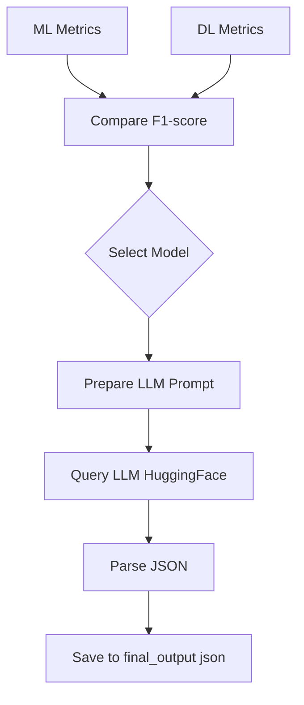
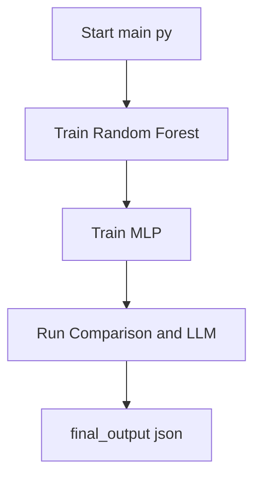
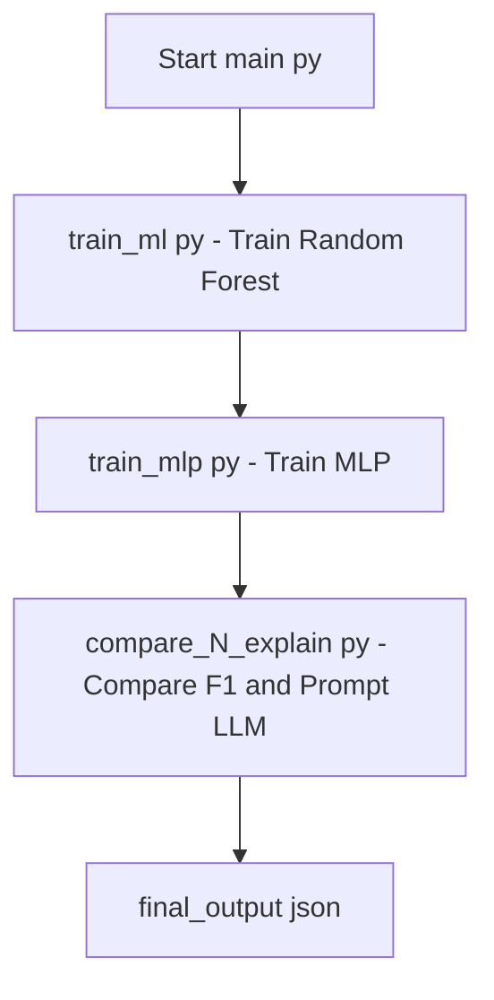

# 📌 Project Overview

This project demonstrates a complete end-to-end AI pipeline that integrates three complementary components. It combines classical Machine Learning, Deep Learning, and a Large Language Model to address loan approval prediction and explainability. The core idea is to keep prediction logic in ML/DL models and use the LLM only for human-friendly explanations.

- Machine Learning (ML) for robust tabular prediction  
- Deep Learning (DL) using a simple neural network (ANN / MLP)  
- Large Language Model (LLM) for explainability  

The system predicts loan approval from a CSV dataset and then uses an LLM to explain the final decision in natural language, returning the result in JSON format.

- ⚠️ **Important:** The LLM is not used for prediction. It is used only as an explanation layer.

## 🎯 Objectives

This section summarizes what the pipeline is designed to achieve end to end.

- Train one ML model and one DL model  
- Evaluate both models fairly using standard metrics  
- Select the best model using F1-score  
- Convert model results into a text input (prompt)  
- Use an LLM to generate a natural-language explanation  
- Return output in structured JSON format  

## 📂 Dataset Description

The system expects a tabular CSV dataset focused on loan applications. It contains a binary target field and multiple feature categories.

- **Format:** CSV (Tabular Data)  
- **Rows:** ~45,000  
- **Target Column:** `loan_status`  

**Feature Categories:**

- Applicant demographics (age, gender, education)  
- Financial data (income, credit score)  
- Loan details (amount, interest rate, intent)  
- Credit history indicators  

This dataset is ideal for comparing tree-based ML models vs neural networks.

## 🧠 Models Used

This pipeline trains two complementary models on the same preprocessed data. Their performance is compared numerically before selecting the winner.

### 1️⃣ Machine Learning Model — Random Forest Classifier

This is the classical ML baseline that works very well on tabular data. It captures complex relationships without heavy feature engineering.

**Why Random Forest?**

- Excellent performance on structured/tabular data  
- Handles non-linear relationships  
- Robust to noise and feature scaling  
- Strong baseline for financial datasets  

- **Saved as:** `models/random_forest.pkl`  

### 2️⃣ Deep Learning Model — Artificial Neural Network (ANN / MLP)

This is a simple multilayer perceptron designed for tabular input. It operates on scaled and encoded features.

**Architecture:**

- Input → Dense(128) → Dense(64) → Dense(32) → Output (Sigmoid)  

**Training Details:**

- Optimizer: Adam  
- Loss: Binary Crossentropy  
- Regularization: Dropout  
- Early stopping to avoid overfitting  

**Why ANN (MLP)?**

- Satisfies the “simple neural network” requirement  
- Enables ML vs DL comparison  
- Learns non-linear feature interactions  

- **Saved as:** `models/mlp_model.h5`  

## 📊 Model Evaluation & Selection

The system evaluates both models using standard classification metrics. This ensures a fair and quantitative comparison between ML and DL.

### Evaluation Metrics

Both ML and DL models are evaluated using:

- Accuracy  
- Precision  
- Recall  
- F1-score  

### 🔑 Model Selection Rule

The final model is selected strictly based on F1-score. This metric provides the best balance between precision and recall for loan approval problems.

- 📌 Decision logic is implemented in code — not by the LLM.

## 📈 Confidence Calculation

The pipeline computes a realistic confidence score from the model predictions. It avoids overconfident outputs driven by a few extreme predictions.

- Model confidence is calculated as: mean predicted probability across the test dataset.  

This avoids misleading 100% confidence caused by outlier predictions and provides a realistic estimate.

## 🤖 LLM Integration (Explainability Layer)

The LLM serves as a pure explainability layer. It receives model metrics and decisions as text and returns a human-friendly justification in JSON.

### What does “Take a text input and use an LLM” mean?

The phrase describes how the system interacts with the LLM.

- Convert model results and decision logic into a text prompt  
- Pass this prompt to an LLM  
- Let the LLM explain the decision in natural language  
- Return output in JSON format  

### 🔍 LLM Details

The project uses an open-source LLM via Hugging Face. LangChain wraps the endpoint to simplify prompting and parsing.

- Model: `openai/gpt-oss-120b`  
- Framework: LangChain + HuggingFaceEndpoint  
- Role: Explanation only (no prediction)  

## 🧩 Architecture Diagram

This diagram shows the logical flow of data from raw CSV to final JSON explanation. It highlights where ML/DL prediction ends and LLM explanation begins.

### 📐 System Architecture (Logical View)

```text
                    ┌───────────────────┐
                    │   Loan CSV Data   │
                    └─────────┬─────────┘
                              │
                              ▼
                  ┌───────────────────────┐
                  │   Data Preprocessing  │
                  │ (cleaning, encoding)  │
                  └─────────┬─────────────┘
                            │
            ┌───────────────┴───────────────┐
            ▼                               ▼
┌─────────────────────┐           ┌─────────────────────┐
│ Random Forest (ML)  │           │   MLP / ANN (DL)    │
│  - Tabular model    │           │  - Neural network   │
└─────────┬───────────┘           └─────────┬───────────┘
          │                                   │
          ▼                                   ▼
     ML Metrics                          DL Metrics
          │                                   │
          └───────────────┬─────────────┘
                          ▼
                ┌─────────────────────┐
                │ Model Selection     │
                │   (F1-score)        │
                └─────────┬───────────┘
                          ▼
                ┌─────────────────────┐
                │ Text Prompt Builder │
                │ (metrics → text)    │
                └─────────┬───────────┘
                          ▼
                ┌─────────────────────┐
                │ LLM (GPT-OSS-120B)  │
                │ Explanation Layer   │
                └─────────┬───────────┘
                          ▼
                ┌─────────────────────┐
                │ JSON Explanation    │
                └─────────────────────┘
```

📌 **Key Highlight:**

- Prediction → done by ML/DL  
- Explanation → done by LLM  

## 🔄 Workflow Diagram (Execution Flow)

This list summarizes the end-to-end execution steps. It follows the same logical order as the code.

```text
Start
  ↓
Load CSV Dataset
  ↓
Preprocess Data
  ↓
Train ML Model (Random Forest)
  ↓
Evaluate ML Metrics
  ↓
Train DL Model (MLP)
  ↓
Evaluate DL Metrics
  ↓
Compare Models (F1-score)
  ↓
Select Best Model
  ↓
Build Text Prompt
  ↓
Call LLM for Explanation
  ↓
Generate JSON Output
  ↓
Save Output
  ↓
End
```

## 📁 Project Structure

The file tree below shows how data, code, models, and outputs are organized. This matches the expectations of the code paths used in the scripts.

```text
task_2A/
│
├── data/
│   └── loan_data.csv
│
├── models/
│   ├── random_forest.pkl
│   └── mlp_model.h5
│
├── src/
│   ├── preprocessing.py
│   ├── train_ml.py
│   ├── train_mlp.py
│   ├── compare_N_explain.py
│   └── main.py
│
├── outputs/
│   └── final_output.json
│
├── .env
├── requirements.txt
└── README.md
```

## ▶️ How to Run (Single Command)

You can reproduce the entire pipeline with a few simple steps. The process covers setup, dependency installation, and full execution.

1. **Set Hugging Face Token**  
   Create a `.env` file:

   ```bash
   HUGGINGFACEHUB_API_TOKEN=hf_your_token_here
   ```

2. **Install dependencies**

   ```bash
   pip install -r requirements.txt
   ```

3. **Run entire pipeline**

   ```bash
   cd src
   python main.py
   ```

This single command:

- Trains ML and DL models  
- Saves trained models  
- Compares performance  
- Calls LLM  
- Generates JSON explanation  

## 🧾 Final Output Format

The final JSON file contains both the decision and the explanation. The LLM produces the explanation text using the prompt constructed from model metrics.

```json
{
  "prediction": "Loan Approved",
  "confidence": "98.7%",
  "ml_vs_dl_comparison": "Random Forest achieved a higher F1-score than the MLP model.",
  "llm_explanation": "The loan was approved because the applicant demonstrates strong financial stability and low risk of default."
}
```

---

# 📦 Integrated ML–DL–LLM Loan Approval System Documentation

This documentation details each file in your system, providing a comprehensive guide to the logic, data flow, and ML/DL/LLM integration for loan approval prediction and explainability.

---

## `compare_N_explain.py`

This module powers the **model comparison and LLM-based explanation** layer. It selects the best model based on F1-score, crafts a prompt for a Large Language Model (LLM), and parses its explanation into a structured JSON output.

### Key Responsibilities

- **Environment Setup:** Loads the Hugging Face API token from `.env`.
- **Model Selection:** Compares ML and DL models by their F1-scores.
- **LLM Explanation:** Forms a prompt for the LLM, invokes it, and extracts a valid JSON explanation.
- **Output Saving:** Saves the LLM's explanation to `../outputs/final_output.json`.

### Main Function

```python
def run_explanation_pipeline(ml_metrics, dl_metrics):
    # Select model by F1-score
    # Formulate prompt for LLM
    # Query HuggingFace LLM for JSON explanation
    # Parse and save response
    # Return explanation as dict
```

### Model Selection Logic

- **If Random Forest F1 ≥ MLP F1:** Select Random Forest.
- **Else:** Select MLP.
- **Comparison phrase** is generated for JSON output.

### LLM Prompt & Output

- LLM is instructed to return a **valid JSON** with:
  - `prediction`
  - `confidence`
  - `ml_vs_dl_comparison`
  - `llm_explanation`

- The code **extracts JSON** from the LLM output robustly, with a fallback if parsing fails.

### Output Example

```json
{
  "prediction": "Loan Approved",
  "confidence": "82.66%",
  "ml_vs_dl_comparison": "Random Forest achieved a higher F1-score than the MLP model.",
  "llm_explanation": "The Random Forest model was chosen because it attained the highest F1-score (0.827) among the candidates, indicating better overall classification performance. Based on this model, the applicant meets the criteria for loan approval with a confidence of approximately 82.7%. This decision reflects the model's ability to balance precision and recall effectively."
}
```

### Data and Flow Diagram



---

## `__init__.py`

This file is intentionally left empty. Its presence makes the directory a **Python package**, allowing for proper module imports within the project structure.

---

## `main.py`

This is the **entry point** for running the full end-to-end pipeline. It coordinates model training, comparison, and explanation generation.

### What It Does

- **Trains the ML model** (Random Forest)
- **Trains the DL model** (MLP / ANN)
- **Compares** their performance and triggers LLM-based explanation
- **Notifies** user of progress and output location

### Code Walkthrough

```python
def main():
    print("Starting end-to-end pipeline...\n")

    print("Training ML model (Random Forest)...")
    ml_metrics = train_ml()
    print("ML Metrics:", ml_metrics, "\n")

    print("Training DL model (MLP / ANN)...")
    dl_metrics = train_mlp()
    print("DL Metrics:", dl_metrics, "\n")

    print("Running comparison + LLM explanation...")
    run_explanation_pipeline(ml_metrics, dl_metrics)

    print("\n Pipeline completed successfully")
    print("Output saved to outputs/final_output.json")

if __name__ == "__main__":
    main()
```

### Process Overview



---

## `train_ml.py`

This script handles **training and evaluating the Random Forest model** on the loan dataset.

### Steps Performed

- **Data Loading & Preprocessing:** Uses `load_and_preprocess_data`.
- **Model Training:** Random Forest with 200 trees and min 2 samples per leaf.
- **Prediction & Evaluation:** Computes all key metrics.
- **Persistence:** Saves model as `random_forest.pkl`.
- **Returns:** Metrics and mean predicted probability as "confidence".

### Key Code Sections

```python
model = RandomForestClassifier(
    n_estimators=200,
    min_samples_leaf=2,
    random_state=42,
    n_jobs=-1
)
model.fit(X_train, y_train)
y_pred = model.predict(X_test)
y_prob = model.predict_proba(X_test)[:, 1]
```

### Returned Metrics

- model: "Random Forest"
- accuracy
- precision
- recall
- f1
- confidence (mean probability, as a percentage)

---

## `preprocessing.py`

This module contains **data ingestion and transformation logic** to prepare input features for both ML and DL models.

### Preprocessing Pipeline

1. **CSV Reading:** Loads the data.
2. **Target Encoding:** Encodes `loan_status` if categorical.
3. **Missing Value Imputation:**
   - Numerical: median
   - Categorical: most frequent
4. **One-Hot Encoding:** On categorical features.
5. **Train-Test Split:** 80%/20%, stratified by target.
6. **Scaling:** StandardScaler for features (for DL).

### Returns

- Raw and scaled train/test splits for maximum flexibility.

### Function

```python
def load_and_preprocess_data(csv_path):
    # Steps as described above
    return X_train, X_test, X_train_scaled, X_test_scaled, y_train, y_test
```

---

## `train_mlp.py`

This script implements the **Deep Learning model** — an MLP (ANN) — using TensorFlow/Keras.

### Steps Performed

- **Preprocessing:** Uses scaled data from `preprocessing.py`.
- **Model Architecture:**
  - Dense(128) → Dropout(0.3)
  - Dense(64) → Dropout(0.25)
  - Dense(32) → Dropout(0.2)
  - Output: Dense(1, sigmoid)
- **Compilation:**
  - Optimizer: Adam
  - Loss: binary_crossentropy
  - Metrics: accuracy
- **Training:** Up to 50 epochs, early stopping with patience 6.
- **Prediction:** On test set, thresholded at 0.5.
- **Persistence:** Saves model as `mlp_model.h5`.
- **Returns:** Metrics and mean prediction probability ("confidence").

### Model Summary

| Layer   | Units | Activation | Dropout |
|---------|-------|------------|---------|
| Dense   | 128   | relu       | 0.3     |
| Dense   | 64    | relu       | 0.25    |
| Dense   | 32    | relu       | 0.2     |
| Output  | 1     | sigmoid    | -       |

---

## `final_output.json`

This file contains the **final, human-readable, LLM-generated explanation** in machine-consumable JSON.

### Example Content

```json
{
  "prediction": "Loan Approved",
  "confidence": "82.66%",
  "ml_vs_dl_comparison": "Random Forest achieved a higher F1-score than the MLP model.",
  "llm_explanation": "The Random Forest model was chosen because it attained the highest F1-score (0.827) among the candidates, indicating better overall classification performance. Based on this model, the applicant meets the criteria for loan approval with a confidence of approximately 82.7%. This decision reflects the model's ability to balance precision and recall effectively."
}
```

### Structure

- **prediction:** Final decision ("Loan Approved" or "Loan Rejected")
- **confidence:** Model's average confidence (%)
- **ml_vs_dl_comparison:** Explanation of model selection
- **llm_explanation:** Human-friendly reasoning (from the LLM)

---

## `requirements.txt`

Lists all dependencies required for running the system.

### Main Libraries

- **langchain-huggingface / langchain / langchain_core:** For LLM orchestration.
- **huggingface_hub:** Connects to Hugging Face endpoints.
- **python-dotenv:** For environment variable management.
- **scikit-learn:** ML models and preprocessing.
- **tensorflow:** For the MLP (ANN) model.

### Example

```text
langchain-huggingface
langchain
langchain_core
langchain-community
huggingface_hub
python-dotenv
scikit-learn
tensorflow
```

---

# 📈 Model Training and Selection Pipeline

Here's how the whole process fits together. This high-level view shows how each script contributes to the final explanation.



---

# 🛠️ Key Implementation Ideas

These points summarize the main design principles of the system. They help ensure responsible and interpretable AI behavior.

- **Strict Metric-Based Selection:** Only the F1-score determines the winning model, ensuring a fair, quantitative comparison.
- **Separation of Concerns:** ML/DL handle prediction; LLM only explains, never predicts.
- **Robust Output Handling:** LLM output is always expected as JSON, parsed carefully for resilience to LLM quirks.
- **Confidence Score:** Uses mean probability, not just binary outcome.
- **Single-Command Pipeline:** After configuration, just run `python main.py` for the full process.

---

# 📝 How To Run

You can set up and execute the whole pipeline with these steps. They mirror the logic described earlier in the project overview.

1. Set your **Hugging Face API Token** in `.env`
2. Install dependencies:

   ```bash
   pip install -r requirements.txt
   ```

3. Run the pipeline:

   ```bash
   cd src
   python main.py
   ```

---

# 🔑 Best Practices

```card
{
    "title": "Best Practices Followed",
    "content": "Model selection is based strictly on F1-score. LLM is used exclusively for explanations, not for prediction."
}
```

---

# 🚨 LLM Usage Guidelines

```card
{
    "title": "Do Not Use LLM for Prediction",
    "content": "The LLM should never be used to make or influence the loan decision. Use it only for explanations."
}
```

---

# 🧩 File Roles Table

| File                  | Purpose                                             |
|-----------------------|-----------------------------------------------------|
| compare_N_explain.py  | Compare models and produce LLM-generated explanation|
| __init__.py           | Marks package boundary                              |
| main.py               | Orchestrates full pipeline                          |
| train_ml.py           | Trains and evaluates Random Forest model            |
| train_mlp.py          | Trains and evaluates MLP (ANN) model                |
| preprocessing.py      | Data loading and preprocessing                      |
| final_output.json     | Final JSON explanation output                       |
| requirements.txt      | Dependency list                                     |

---

# ✅ Summary

This system exemplifies responsible, end-to-end AI design: **models predict, LLM explains, and decision logic is always transparent**. Each file plays a distinct role in ensuring a robust, reproducible, and interpretable pipeline for loan approval automation and explanation.

---

