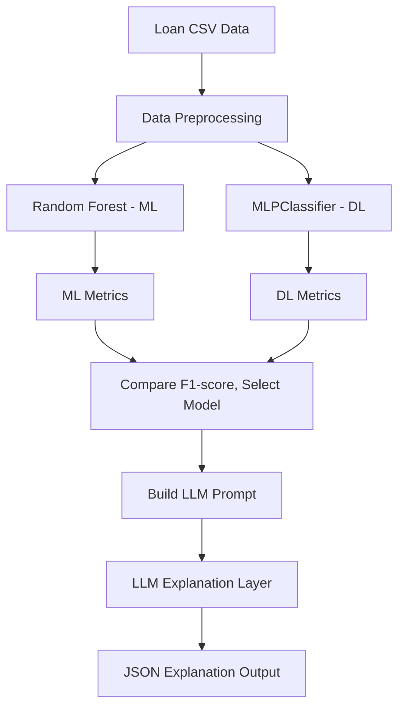
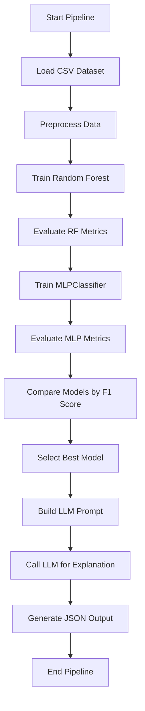
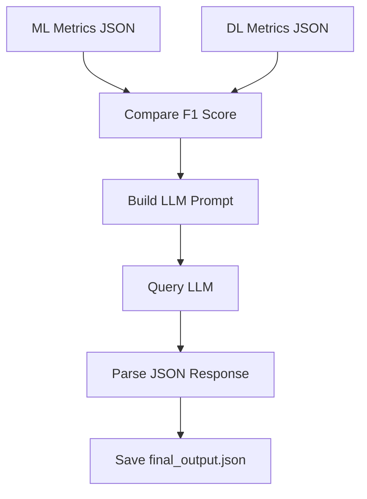

# 📌 Project Overview

This project implements an end-to-end AI pipeline for **loan approval prediction and explainability**. The system combines classical Machine Learning (ML), Deep Learning (DL), and a Large Language Model (LLM) to deliver both predictive performance and human-readable justifications. The design ensures that **ML/DL models make predictions** while the **LLM is used solely for explanations**.

- **Machine Learning:** Random Forest Classifier for tabular data.
- **Deep Learning:** Multilayer Perceptron (MLP) via scikit-learn.
- **LLM:** Natural-language explanations via Hugging Face's GPT-OSS-120B.

> ⚠️ **Note:** The LLM never predicts; it only explains decisions already made by the ML/DL models.

---

## 🎯 Objectives

- Train, tune, and evaluate both ML and DL models on the same preprocessed tabular dataset.
- Select the best-performing model using F1-score.
- Generate a natural-language explanation for the prediction using the LLM.
- Output a structured JSON containing the decision, confidence, comparison, and explanation.

---

## 🔁 Execution Modes

The project supports two logical phases that run independently. The **Training Phase** handles model tuning and saving of all artifacts, while the **Inference Phase** is the default execution in `main.py`. During inference, `main.py` loads pre-trained models and metrics instead of retraining them. This separation improves modularity and makes the system easier to deploy.

---

## 📂 Dataset Description

- **Format:** CSV with tabular data.
- **Rows:** ~45,000
- **Target:** `loan_status` (binary)
- **Features:**
  - Demographics: age, gender, education
  - Financials: income, credit score
  - Loan details: amount, intent, interest rate
  - Credit history

---

## 🧠 Models Used

### 1️⃣ Random Forest Classifier (ML)

- **Why:** Strong performance on tabular, structured data.
- **Features:** Handles non-linearity, robust to noise, requires minimal feature scaling.
- **Validation:** Uses Out-Of-Bag (OOB) score for additional assessment.
- **Saved as:** `models/random_forest.pkl`

### 2️⃣ MLPClassifier (DL)

- **Why:** Enables direct ML vs DL comparison on tabular data.
- **Library:** scikit-learn's `MLPClassifier` (not TensorFlow/Keras).
- **Architecture:** Configurable hidden layers, trained on scaled features.
- **Saved as:** `models/mlp_classifier.pkl`

---

## 🔬 Hyperparameter Optimization

Both models are tuned using `RandomizedSearchCV` with `StratifiedKFold` (k=5) cross-validation:

- **Random Forest:** n_estimators, max_depth, min_samples_split, class_weight, etc.
- **MLPClassifier:** hidden_layer_sizes, activation, alpha, learning_rate_init, batch_size.

This ensures a fair and robust comparison by searching for each model’s best configuration.

---

## ⚖️ Handling Class Imbalance

The dataset contains an imbalance between approved and rejected loans. The stratified train-test split ensures similar class distribution in both sets. `StratifiedKFold` preserves class ratios during cross-validation. Random Forest can use `class_weight` settings when enabled to reduce majority-class bias. These choices reflect awareness of real-world ML challenges.

---

## 📊 Model Evaluation & Selection

- **Metrics:** Accuracy, Precision, Recall, F1-score.
- **Selection Rule:** The model with the highest test F1-score is selected for the final prediction.
- **Storage:** Model performance metrics are saved to:
  - `models/ml_metrics.json`
  - `models/dl_metrics.json`

---

## 📈 Sample Performance Snapshot

| Model         | Accuracy | Precision | Recall | F1-score |
|--------------|----------|-----------|--------|----------|
| Random Forest | 0.9298  | 0.8559    | 0.8225 | 0.8389   |
| MLPClassifier | 0.9188  | 0.8775    | 0.7375 | 0.8014   |

In this configuration, Random Forest achieved the highest F1-score and was selected as the final prediction model.

---

## 📈 Confidence Calculation

- **Definition:** Confidence is the **predicted probability of the selected class** for the given applicant, not an average over the test set.
- **Reason:** This provides a true, personalized certainty level for each prediction.

---

## 🔎 Why Random Forest Often Outperforms MLP on Tabular Data

Random Forests excel at capturing complex, non-linear relationships in structured datasets, handling missing values, and requiring minimal feature engineering. MLPs can underperform due to:
- Sensitivity to feature scaling and encoding.
- Need for large data and tuning to avoid overfitting.
- Less interpretability on tabular data without careful design.

---

## 🤖 LLM Integration (Explainability Layer)

- **Prompt:** The selected model, its metrics, and the final decision are converted to a prompt for the LLM.
- **Model:** `openai/gpt-oss-120b` via Hugging Face, orchestrated by LangChain.
- **Role:** Only explains the decision; does not influence or make predictions.
- **Output:** Structured JSON with explanation.

---

## 🧩 System Architecture



---

## 🔄 Workflow Diagram



---

## 📁 Project Structure

```text
project_root/
│
├── data/
│   └── loan_data.csv
│
├── models/
│   ├── random_forest.pkl
│   ├── mlp_classifier.pkl
│   ├── scaler.pkl
│   └── feature_columns.pkl
│
├── src/
│   ├── __init__.py
│   ├── preprocessing.py
│   ├── train_ml.py
│   ├── train_mlp.py
│   ├── predict_new.py
│   ├── compare_N_explain.py
│   └── main.py
│
├── outputs/
│   └── final_output.json
│
├── .env
├── requirements.txt
└── README.md
```

---

# 📦 Integrated ML–DL–LLM Loan Approval System Documentation

This section details the purpose, logic, and structure of each file in the system.

---

## `__init__.py`

This file is **empty** and exists only to mark the `src` directory as a Python package. It enables module imports between scripts in the folder.

---

## `main.py`

This script is the **pipeline orchestrator**. It loads trained models and metrics, compares their performance, predicts for a new applicant, and generates an LLM-based explanation.

### Responsibilities

- Load trained models and data transformers from disk.
- Load model evaluation metrics (from JSON files).
- Select the best model based on F1-score.
- Predict the approval decision for a demo applicant.
- Format and display prediction and confidence.
- Trigger the explanation generation pipeline via the LLM.
- Save the final output as a JSON file.

### Core Process

```python
def main():
    print("Starting end-to-end pipeline (Inference Mode)...")

    # Load trained models and artifacts
    rf_model = joblib.load("../models/random_forest.pkl")
    mlp_model = joblib.load("../models/mlp_classifier.pkl")
    scaler = joblib.load("../models/scaler.pkl")
    feature_columns = joblib.load("../models/feature_columns.pkl")

    # Load metrics
    with open("../models/ml_metrics.json") as f:
        ml_metrics = json.load(f)
    with open("../models/dl_metrics.json") as f:
        dl_metrics = json.load(f)

    # Select model based on F1-score
    if ml_metrics["f1"] >= dl_metrics["f1"]:
        selected_model, selected_type = rf_model, "ML"
    else:
        selected_model, selected_type = mlp_model, "DL"

    # Run prediction on new applicant data
    prediction, confidence_value = predict_new_input(
        person_age=35, person_gender="male", person_education="Bachelor", person_income=60000,
        person_emp_exp=5, person_home_ownership="RENT", loan_amnt=15000, loan_intent="PERSONAL",
        loan_int_rate=12.5, loan_percent_income=0.25, cb_person_cred_hist_length=6, credit_score=720,
        previous_loan_defaults_on_file="No", model=selected_model, scaler=scaler,
        feature_columns=feature_columns, model_type=selected_type
    )

    final_prediction_label = "Loan Approved" if prediction == 1 else "Loan Rejected"
    confidence = f"{confidence_value * 100:.2f}%"
    print(f"Final Prediction: {final_prediction_label}")
    print(f"Confidence: {confidence}")

    # Generate and save LLM explanation
    run_explanation_pipeline(ml_metrics, dl_metrics, final_prediction_label, confidence)
    print("Pipeline completed successfully.")
    print("Output saved to outputs/final_output.json")
```

---

## `predict_new.py`

This module handles **prediction for new applicant data** using the selected model and the preprocessing pipeline.

### Responsibilities

- Accepts applicant features as function arguments.
- Builds a single-row DataFrame.
- One-hot encodes and aligns features to match training columns.
- Applies scaling if needed (for DL).
- Predicts the class and confidence using the model.
- Returns the prediction and confidence score.

### Core Function

```python
def predict_new_input(
    person_age, person_gender, person_education, person_income, person_emp_exp,
    person_home_ownership, loan_amnt, loan_intent, loan_int_rate, loan_percent_income,
    cb_person_cred_hist_length, credit_score, previous_loan_defaults_on_file,
    model, scaler, feature_columns, model_type
):
    # Build and one-hot encode input DataFrame
    # Align columns to training set
    # Scale if needed
    # Predict and return (class, probability)
```

- **Confidence Score:** Calculated as the probability assigned to the predicted class for this specific input.

---

## `compare_N_explain.py`

This module handles **model selection and LLM-based explanations**.

### Responsibilities

- Loads Hugging Face API token from `.env`.
- Compares F1-scores to pick the best model.
- Builds a prompt summarizing the model metrics and decision.
- Invokes the Hugging Face LLM endpoint to generate a JSON explanation.
- Extracts and saves the LLM output to `../outputs/final_output.json`.

### Core Functionality

```python
def run_explanation_pipeline(
    ml_metrics, dl_metrics, final_prediction_label, confidence
):
    # Select best model by F1-score
    # Build prompt for LLM
    # Query LLM endpoint using langchain
    # Parse JSON from LLM response
    # Save result to output json
```

### Data Flow



---

## `train_ml.py`

This script **trains and tunes the Random Forest classifier**.

### Responsibilities

- Loads and preprocesses data via `load_and_preprocess_data`.
- Defines a hyperparameter search space for Random Forest.
- Uses `RandomizedSearchCV` with `StratifiedKFold` (k=5) for tuning.
- Evaluates the model using accuracy, precision, recall, F1-score, and OOB score.
- Saves:
  - The trained model (`random_forest.pkl`)
  - Feature columns (`feature_columns.pkl`)
  - Metrics (`ml_metrics.json`)
- Returns artifacts for use in the pipeline.

### Core Steps

```python
def train_ml():
    # Load and preprocess data
    # Define Random Forest and hyperparameter grid
    # Tune with RandomizedSearchCV + StratifiedKFold
    # Evaluate and save model, metrics, feature columns
    # Return all artifacts
```

### Hyperparameter Optimization

- n_estimators, max_depth, min_samples_split, min_samples_leaf, max_features, bootstrap, class_weight.
- **OOB Score:** Used for additional internal validation.

---

## `train_mlp.py`

This script **trains and tunes the Deep Learning model** (MLPClassifier from scikit-learn).

### Responsibilities

- Loads and preprocesses data (with scaling).
- Defines a hyperparameter search space for the MLP.
- Uses `RandomizedSearchCV` + `StratifiedKFold` (k=5) for tuning.
- Evaluates the model with standard metrics (accuracy, precision, recall, F1-score).
- Saves:
  - The trained MLP (`mlp_classifier.pkl`)
  - The scaler (`scaler.pkl`)
  - Feature columns (`feature_columns.pkl`)
  - Metrics (`dl_metrics.json`)
- Returns trained model and artifacts.

### Core Steps

```python
def train_mlp():
    # Load and preprocess data (scaled)
    # Define MLP and hyperparameter grid
    # Tune with RandomizedSearchCV + StratifiedKFold
    # Evaluate and save model, scaler, metrics, columns
    # Return all artifacts
```

---

## `preprocessing.py`

This module **prepares the data** for both ML and DL training.

### Responsibilities

- Loads CSV dataset.
- Encodes the target (`loan_status`) if categorical.
- Imputes missing values:
  - **Numerical:** Median
  - **Categorical:** Most frequent
- One-hot encodes all categorical features.
- Splits data into 80/20 train/test sets (stratified).
- Applies `StandardScaler` (for DL model input).
- Returns both raw and scaled train/test splits, scaler, and feature columns.

### Core Function

```python
def load_and_preprocess_data(csv_path):
    # Read, encode, impute, one-hot, split, scale, return artifacts
```

---

# 🧾 Final Output Format

The pipeline generates a single **JSON result file** (in `outputs/final_output.json`):

```json
{
  "prediction": "Loan Approved",
  "confidence": "98.30%",
  "ml_vs_dl_comparison": "Random Forest achieved a higher F1-score than the MLP model.",
  "llm_explanation": "The loan was approved because the applicant meets the criteria as determined by the most accurate model. This reflects strong financial stability and a low risk of default."
}
```

---

## 🔄 Reproducibility

The project uses `random_state=42` across models and cross-validation to fix randomness. Hyperparameter tuning is deterministic under this configuration. All artifacts are saved, including model `.pkl` files, the scaler, feature columns, and metrics JSON files. This ensures consistent predictions and behavior across repeated runs.

---

# ▶️ How to Run

1. **Set API Token:**  
   Add Hugging Face token to `.env`:

   ```bash
   HUGGINGFACEHUB_API_TOKEN=hf_your_token_here
   ```

2. **Install Dependencies:**

   ```bash
   pip install -r requirements.txt
   ```

3. **Run the Pipeline:**

   ```bash
   cd src
   python main.py
   ```

---

# 🧩 File Roles Table

| File                    | Purpose                                              |
|-------------------------|------------------------------------------------------|
| `compare_N_explain.py`  | Compare models and generate LLM explanation          |
| `__init__.py`           | Marks the package boundary, enables module imports   |
| `main.py`               | Orchestrates the entire inference pipeline           |
| `train_ml.py`           | Trains and tunes the Random Forest model             |
| `train_mlp.py`          | Trains and tunes the MLP (ANN) model                 |
| `preprocessing.py`      | Loads and preprocesses tabular data                  |
| `predict_new.py`        | Runs predictions on new applicant input              |
| `outputs/final_output.json` | Holds the final explanation result              |
| `requirements.txt`      | List of required libraries for the project           |

---

# 🛠️ Key Implementation Concepts

- **Strict F1-Score Selection:** The system always selects the model with the highest F1-score.
- **Separation of Concerns:** ML/DL models predict; LLM only explains.
- **Hyperparameter Tuning:** Both models are tuned via RandomizedSearchCV with StratifiedKFold.
- **Confidence Calculation:** Based on the predicted probability for the applicant—not an average.
- **Reproducibility:** Models, scalers, and feature columns are saved and reused.

---

# 🔑 Best Practices

```card
{
    "title": "Best Practices Followed",
    "content": "Model selection is based strictly on F1-score. LLM is used exclusively for explanations, not for prediction."
}
```

---

# 🚨 LLM Usage Guidelines

```card
{
    "title": "Do Not Use LLM for Prediction",
    "content": "The LLM should never be used to make or influence the loan decision. Use it only for explanations."
}
```

---

## 🏗️ Design Philosophy

The system maintains a clear separation between the prediction layer and the explanation layer. It uses a deterministic model selection rule based solely on F1-score. The LLM is sandboxed and cannot influence or override model predictions. The overall design focuses on modularity, reproducibility, and transparency.

---

# ✅ Summary

This pipeline integrates robust ML and DL models with a modern LLM explanation layer using industry best practices. **Predictions come from data-driven models; explanations come from the LLM, ensuring transparency and reliability.** Each file plays a dedicated role, resulting in a clear, reproducible, and interpretable system for automated loan approval and justification.

---
